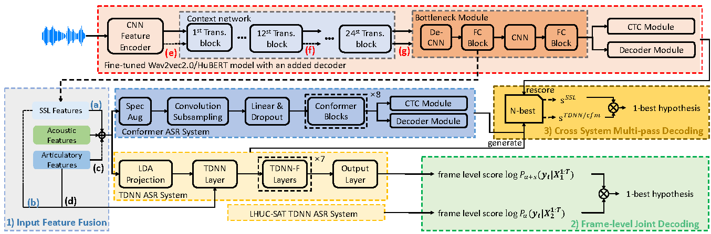

# SFM_for_dysarthric_elderly

This repository is the open source code for our ICASSP 2023 paper and IEEE/ACM TASLP:

[Exploring Self-Supervised Pre-Trained ASR Models for Dysarthric and Elderly Speech Recognition](https://ieeexplore.ieee.org/abstract/document/10097275)

[Self-Supervised ASR Models and Features for Dysarthric and Elderly Speech Recognition](https://ieeexplore.ieee.org/abstract/document/10584335)



## Code

### SFM fine-tuning
You can find an example script for fine-tuning the Wav2Vec2.0 model in `Fine-tuning/run_finetuning_w2v_large.py`.
### SSL Speech Representation Extraction 
1. Bottleneck Module
2. Fine-tuning 
3. Extraction
### A2A Inversion
### SFM integration

## Ciataions

If you find our work inspiring or use our codebase in your research, please consider giving a star ⭐ and citations.

```bibtex
@INPROCEEDINGS{10097275,
  author={Hu, Shujie and Xie, Xurong and Jin, Zengrui and Geng, Mengzhe and Wang, Yi and Cui, Mingyu and Deng, Jiajun and Liu, Xunying and Meng, Helen},
  booktitle={ICASSP 2023 - 2023 IEEE International Conference on Acoustics, Speech and Signal Processing (ICASSP)}, 
  title={Exploring Self-Supervised Pre-Trained ASR Models for Dysarthric and Elderly Speech Recognition}, 
  year={2023},
  volume={},
  number={},
  pages={1-5},
  doi={10.1109/ICASSP49357.2023.10097275}}

@ARTICLE{10584335,
  author={Hu, Shujie and Xie, Xurong and Geng, Mengzhe and Jin, Zengrui and Deng, Jiajun and Li, Guinan and Wang, Yi and Cui, Mingyu and Wang, Tianzi and Meng, Helen and Liu, Xunying},
  journal={IEEE/ACM Transactions on Audio, Speech, and Language Processing}, 
  title={Self-Supervised ASR Models and Features for Dysarthric and Elderly Speech Recognition}, 
  year={2024},
  volume={32},
  number={},
  pages={3561-3575},
  doi={10.1109/TASLP.2024.3422839}}
